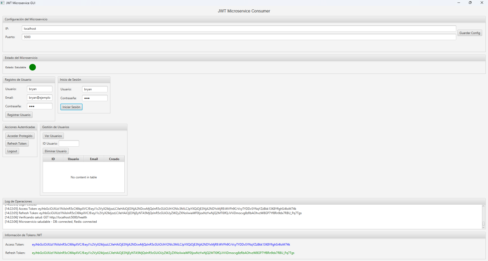
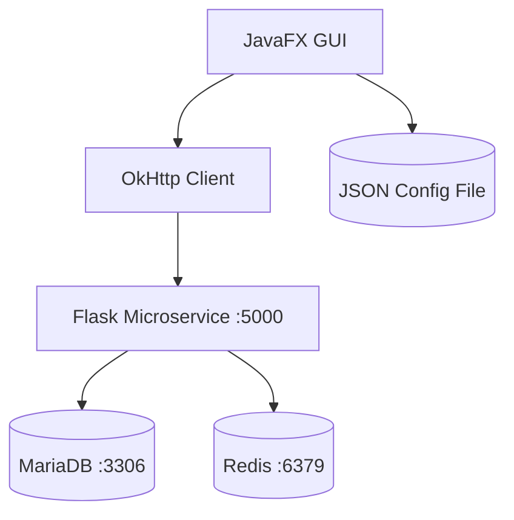
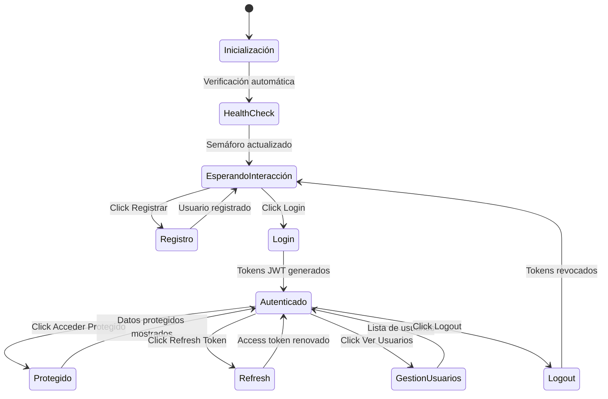

# Cliente GUI JavaFX para Microservicio JWT


## Vista Previa



## Descripción

Aplicación JavaFX moderna que proporciona una interfaz gráfica nativa para consumir y gestionar todos los endpoints del microservicio JWT. Implementa un diseño modular con componentes JavaFX avanzados, sistema de logging en tiempo real, semáforo visual de estado, y persistencia de configuración y tokens JWT en almacenamiento local.

## Arquitectura del Sistema



## Características de la GUI JavaFX

- ✅ **Interfaz Nativa Moderna**: JavaFX con componentes nativos del sistema operativo
- ✅ **FXML Declarativo**: Separación clara entre lógica y presentación
- ✅ **MVC Arquitectura**: Controller maneja lógica de negocio, FXML define UI
- ✅ **Threading Seguro**: Platform.runLater() para actualizaciones UI seguras
- ✅ **Componentes Avanzados**: TableView, Canvas, GridPane para layouts complejos
- ✅ **Logging Integrado**: SLF4J con configuración automática
- ✅ **Gestión de Estado**: Persistencia automática de configuración y tokens

## Diseño de la Interfaz JavaFX

La aplicación JavaFX utiliza un enfoque moderno con FXML para la definición declarativa de la interfaz, separando claramente la presentación de la lógica de negocio.

### Componentes JavaFX Utilizados

- **VBox/HBox**: Contenedores principales para layout vertical/horizontal
- **TitledPane**: Paneles colapsables con títulos descriptivos
- **GridPane**: Layout tabular para formularios organizados
- **TextField/PasswordField**: Campos de entrada para datos de usuario
- **Button**: Botones interactivos con manejadores de eventos
- **Canvas**: Dibujo personalizado del semáforo de estado
- **TableView**: Tabla avanzada para mostrar lista de usuarios
- **TextArea**: Área de texto con scroll para logs
- **Label**: Etiquetas para mostrar información de tokens

### Gestión de Eventos

- **@FXML annotations**: Inyección de componentes desde FXML
- **Event handlers**: Métodos anotados para manejar clics de botones
- **Platform.runLater()**: Actualizaciones seguras del UI desde hilos background
- **Task API**: Operaciones asíncronas sin bloquear la interfaz

## Flujo de Interacción GUI



## Prerrequisitos

- JDK 17 o superior
- Maven 3.6+
- Microservicio JWT corriendo (puerto 5000 por defecto)

## Instalación y Ejecución

```bash
# Compilar y ejecutar
mvn clean compile
mvn javafx:run
```

## Configuración

### Archivo de Configuración (jwt_gui_config.json)

La aplicación crea automáticamente un archivo `jwt_gui_config.json` para almacenar:

```json
{
  "ip": "localhost",
  "port": "5000",
  "endpoints": {
    "register": "/register",
    "login": "/login",
    "refresh": "/refresh",
    "logout": "/logout",
    "protected": "/protected",
    "health": "/health",
    "users": "/users",
    "delete_user": "/users/"
  },
  "access_token": "",
  "refresh_token": ""
}
```

### Configuración Inicial

- **IP**: Dirección del microservicio (por defecto: localhost)
- **Puerto**: Puerto del microservicio (por defecto: 5000)
- **Endpoints**: URLs de los servicios REST

## Uso

### Interfaz de la GUI

La aplicación se divide en secciones organizadas:

1. **Configuración del Microservicio**: Campos para IP y puerto
2. **Estado del Microservicio**: Semáforo visual con indicador de salud
3. **Registro de Usuario**: Campos para crear nueva cuenta
4. **Inicio de Sesión**: Campos para autenticación
5. **Acciones Autenticadas**: Botones para operaciones con tokens
6. **Gestión de Usuarios**: Ver y eliminar usuarios
7. **Log de Operaciones**: Historial detallado de todas las acciones
8. **Información de Tokens JWT**: Display de tokens actuales

### Semáforo de Salud

- 🔴 **Rojo**: Microservicio no funciona
- 🟠 **Naranja**: Procesando verificación
- 🟢 **Verde**: Microservicio saludable

### Funcionalidades Principales

#### Registro de Usuario

- Campos: Usuario, Email, Contraseña
- Validación de campos requeridos
- Logging de la solicitud y respuesta

#### Login

- Campos: Usuario, Contraseña
- Almacenamiento automático de tokens
- Actualización de labels de tokens

#### Acceso Protegido

- Requiere token de acceso válido
- Muestra datos protegidos en log

#### Refresh Token

- Utiliza refresh token para obtener nuevo access token
- Actualiza tokens almacenados

#### Logout

- Revoca tokens en el servidor
- Limpia tokens locales

#### Gestión de Usuarios

- Ver lista completa de usuarios
- Eliminar usuarios (solo el propio usuario)

## Tecnologías Utilizadas

- **JavaFX**: Framework moderno para aplicaciones de escritorio Java
- **FXML**: Lenguaje declarativo para definir interfaces de usuario
- **OkHttp**: Cliente HTTP eficiente para llamadas a la API
- **Jackson**: Procesamiento JSON para configuración y respuestas
- **SLF4J**: Framework de logging unificado
- **Maven**: Gestión de dependencias y construcción del proyecto

## Estructura del Proyecto

```
cliente-jwt-gui/
├── src/
│   └── main/
│       ├── java/com/example/jwttest/
│       │   ├── Main.java              # Punto de entrada JavaFX
│       │   └── JWTController.java     # Lógica de negocio y UI
│       └── resources/
│           └── jwt-gui.fxml           # Definición de interfaz FXML
├── pom.xml                            # Configuración Maven
├── jwt_gui_config.json                # Configuración persistente (generado)
└── README.md                          # Este archivo
```

```bash
cliente-jwt-gui/
├── src/main/java/com/example/jwttest/Main.java
├── src/main/java/com/example/jwttest/JWTController.java
├── src/main/resources/jwt-gui.fxml
├── pom.xml
├── jwt_gui_config.json
└── README.md
```

```bash
cliente-jwt-gui/
├── src/main/java/com/example/jwttest/Main.java
├── src/main/java/com/example/jwttest/JWTController.java
├── src/main/resources/jwt-gui.fxml
├── pom.xml
├── jwt_gui_config.json
└── README.md
```

